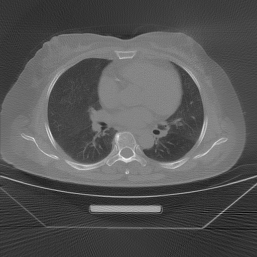

安装环境：
```bash
$ pip install -r requirements.txt
```

使用（JIT 加速）：

```bash
# SL 滤波器
$ python fanfbp.jit.py -i Kernel_Test.mat -k SL

# RL 滤波器
$ python fanfbp.jit.py -i Kernel_Test.mat -k RL
```

GPU 加速（需要 cuda 驱动）：
```bash
$ python fanfbp.cuda.py
```

---

RL 结果


SL 结果


